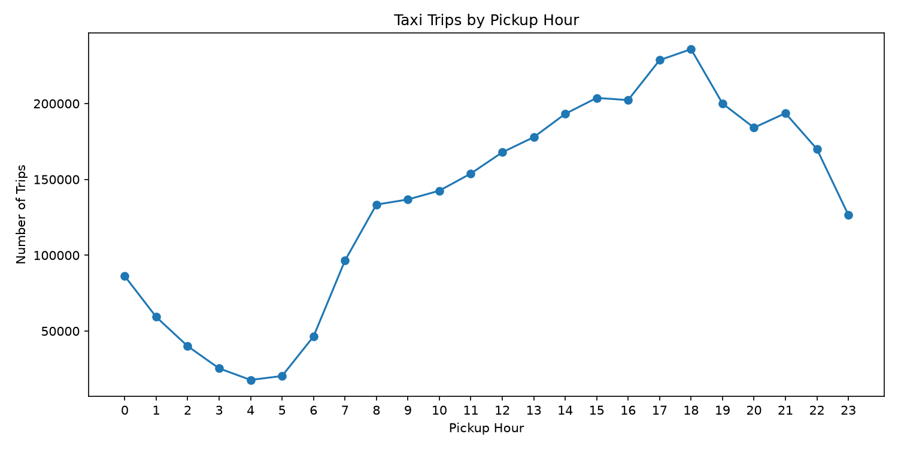
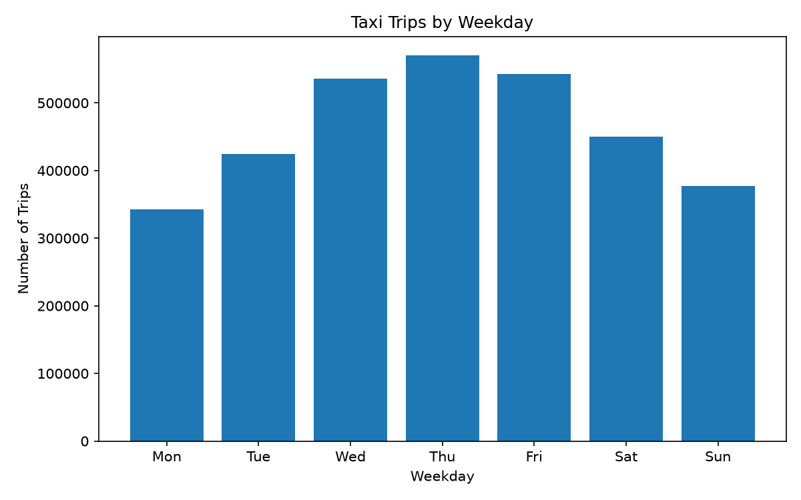
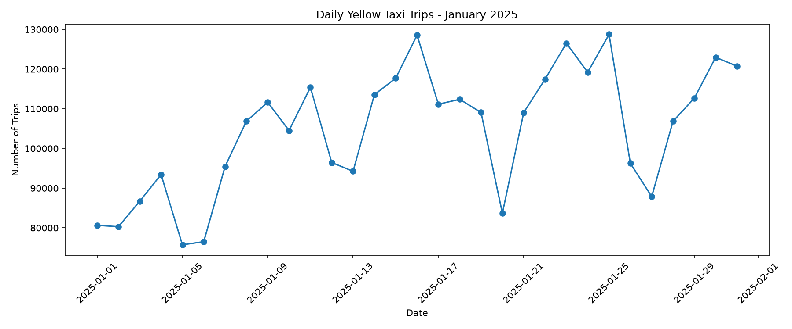
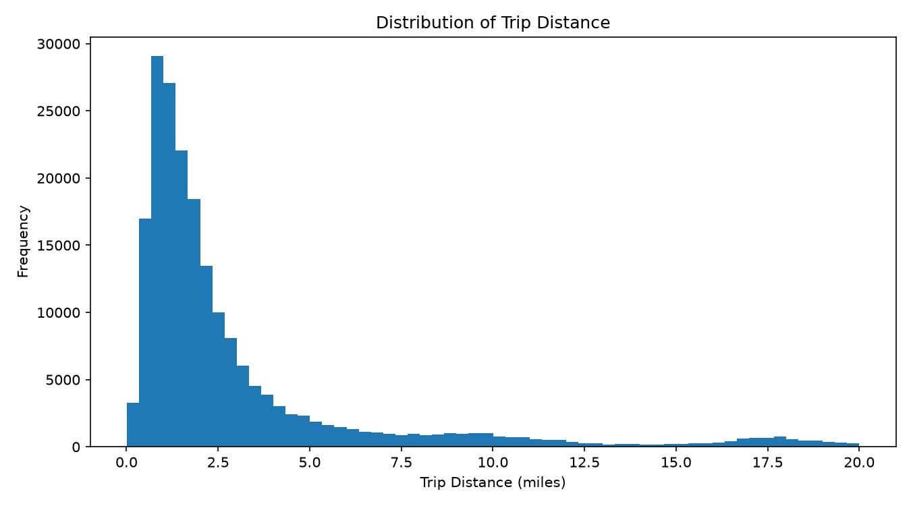
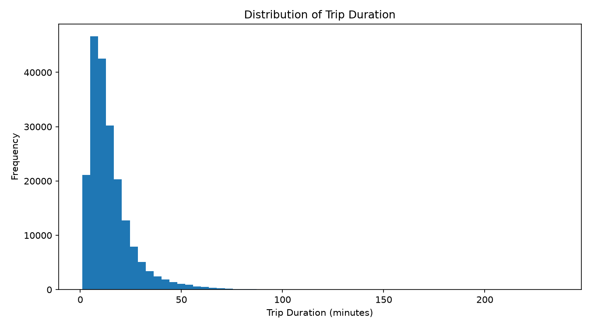
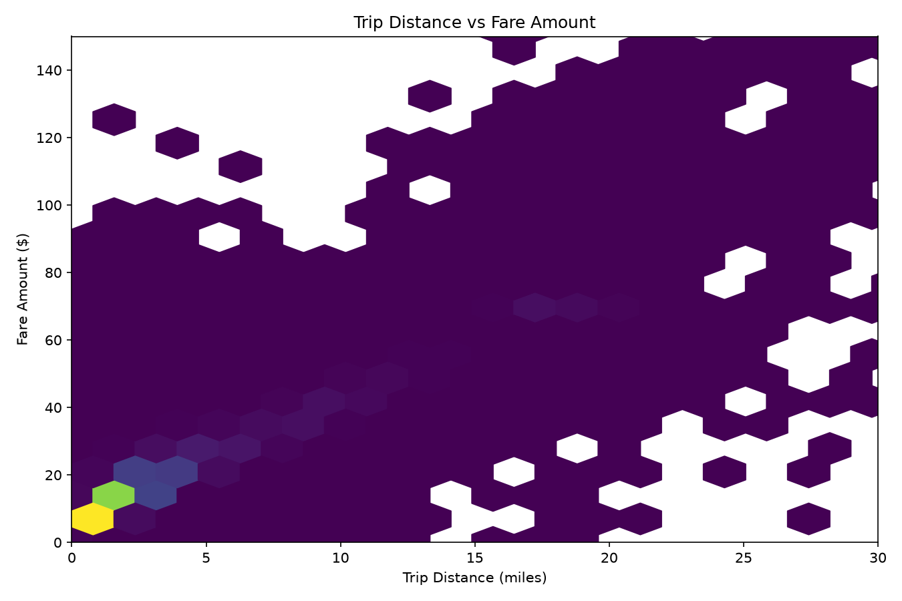
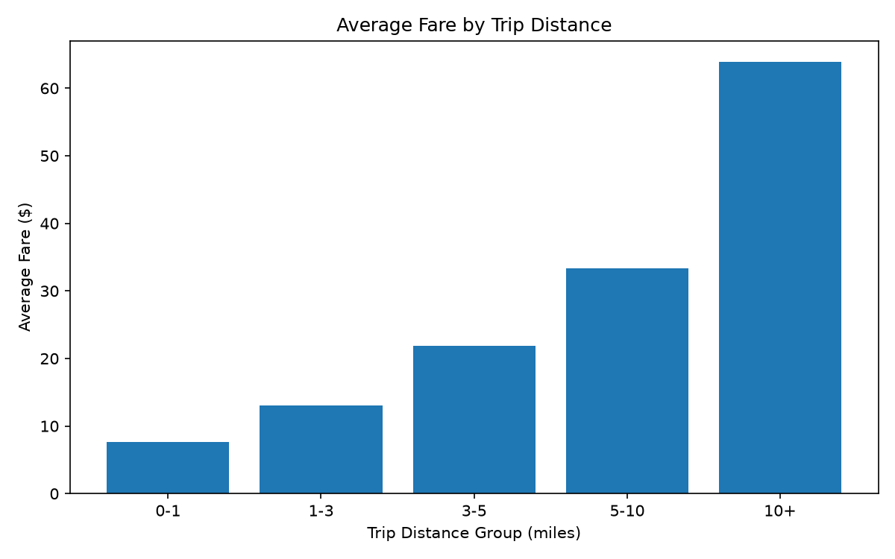
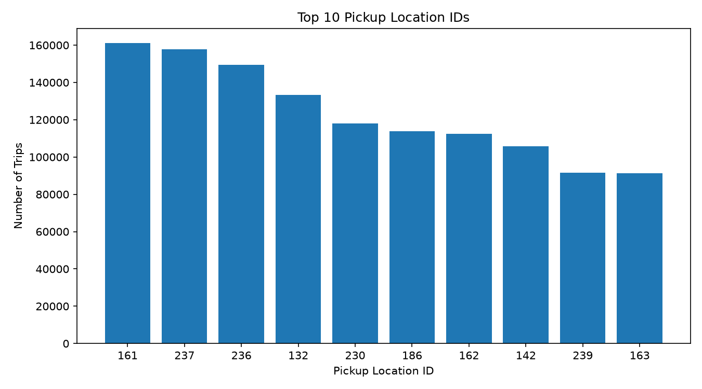

# Phase 2 Report: NYC Yellow Taxi Data Cleaning, Processing, and Exploratory Analysis

## 1. Title and Team Members

**Project Title:** NYC Yellow Taxi Trip Analysis  
**Course:** EAS 587 – Data-Intensive Computing  
**Phase:** Phase 2 – Data Cleaning, Processing, and Exploratory Data Analysis  

**Team Members:**  
- Hwimyeong Baek  
- Colin Seiler
- [Team Member 3]

---

## 2. Executive Summary

In Phase 2, we cleaned and analyzed the January 2025 NYC Yellow Taxi trip dataset. The raw dataset contained 3,475,226 records and 20 columns. We used Polars with lazy execution to support scalable processing and avoid relying only on loading the full raw dataset into memory at once. After removing records with invalid trip times, nonpositive or extreme trip distances, unreasonable trip durations, and extreme fare values, 3,242,213 records remained. This means that about 6.70% of the original records were removed. The cleaned dataset showed clear patterns in taxi demand by hour, day, trip distance, and pickup area. Longer trips had much higher average fares, and taxi demand was lowest during early morning hours and highest during the late afternoon and early evening.

---

## 3. Connection to Phase 1

In Phase 1, our project focused on using NYC taxi trip data to study large-scale transportation patterns. Our main goal was to understand how trip demand, trip distance, fare amount, time of day, and pickup location are related.

Phase 2 continues this plan by preparing the raw taxi data for analysis and producing the first quantitative results. The main research questions explored in this phase are:

1. How does taxi demand change by hour of day and day of week?
2. How strongly are trip distance and fare amount related?
3. What do the distributions of trip distance and trip duration look like?
4. Which pickup locations have the highest taxi activity?
5. How much does average fare change across trip-distance groups?

The overall direction from Phase 1 did not change, but Phase 2 helped us identify which variables are most useful for later modeling in Phase 3.

---

## 4. Data Cleaning and Processing

### 4.1 Data Profiling

The raw January 2025 Yellow Taxi dataset contained **3,475,226 rows and 20 columns**. Initial profiling included schema inspection, null counts, unique-value counts, duplicate detection, numeric summaries, and category counts.

Several data-quality issues were found. For example, `passenger_count` contained a large number of missing values. The raw data also contained negative fare values, zero-distance trips, extremely large trip distances, and invalid trip times where the dropoff time was earlier than or equal to the pickup time.

No exact duplicate rows were found.

### 4.2 Cleaning Rules

We applied the following rules:

- Keep only trips with pickup times in January 2025.
- Keep trip distances greater than 0 and less than or equal to 100 miles.
- Keep trip durations between 1 and 240 minutes.
- Require dropoff time to be later than pickup time.
- Keep fare amounts between $0 and $500.
- Keep total amounts between $0 and $600.

Missing values in `passenger_count`, `RatecodeID`, and `store_and_fwd_flag` were retained rather than dropping the entire trip record. These columns are not required for every analysis, so removing all rows with missing values would discard too much otherwise useful data.

After cleaning, **3,242,213 records remained**, and **233,013 records were removed**, equal to approximately **6.70%** of the original dataset.

### 4.3 Feature Engineering

We created several derived fields for analysis:

- `trip_duration_minutes`
- `pickup_hour`
- `pickup_weekday`
- `pickup_date`

These features made it easier to study hourly, weekday, daily, and duration-based patterns.

### 4.4 Scalable Processing Strategy

The raw Parquet file was processed using **Polars lazy scanning**. This approach allowed filtering and transformation steps to be defined before execution. The cleaned dataset was then written to:

`data/processed/yellow_tripdata_2025-01_clean.parquet`

This approach is more scalable than relying only on a standard full in-memory pandas workflow and is suitable for extending the project to multiple months or much larger taxi datasets later.

---

## 5. Exploratory Data Analysis

### 5.1 Taxi Trips by Pickup Hour

**Figure 1. Taxi trip counts by pickup hour.**

Taxi demand was lowest during the early morning hours, especially around 3 AM to 5 AM. Demand increased strongly after 6 AM and continued rising through the day. The highest trip volume appeared around 5 PM to 6 PM, suggesting a strong evening travel peak.

### 5.2 Taxi Trips by Weekday

**Figure 2. Taxi trip counts by weekday.**

Trip volume was lowest on Monday and increased through the middle of the week. Thursday had the highest number of trips, while Saturday and Sunday were lower than the main weekday peak. This suggests that weekday travel demand is an important part of Yellow Taxi activity.

### 5.3 Daily Taxi Trips in January 2025

**Figure 3. Daily taxi trip counts during January 2025.**

Daily taxi demand varied noticeably during the month instead of remaining constant. Some days exceeded 120,000 trips, while other days fell below 90,000. These changes may be related to weekday effects, holidays, weather, or other external conditions, which could be investigated later.

### 5.4 Distribution of Trip Distance

**Figure 4. Distribution of trip distance based on a reproducible sample of 200,000 trips.**

The trip-distance distribution is strongly right-skewed. Most taxi trips are relatively short, with the largest concentration occurring below approximately 3 miles. Longer trips occur much less frequently, although a clear tail extends toward longer-distance travel.

### 5.5 Distribution of Trip Duration

**Figure 5. Distribution of trip duration based on a reproducible sample of 200,000 trips.**

Trip duration is also right-skewed. Most trips are completed within a relatively short period, while long-duration trips form a much smaller tail. This pattern supports the use of robust summaries such as the median in addition to the mean.

### 5.6 Trip Distance and Fare Amount

**Figure 6. Density-based view of trip distance and fare amount using a 200,000-trip sample.**

Fare amount generally increases as trip distance increases. The relationship is not perfectly uniform because fares can also depend on time, surcharges, airport trips, rate codes, and other factors. Still, the overall positive relationship is strong and is also supported by the calculated correlation.

### 5.7 Average Fare by Trip Distance

**Figure 7. Average fare by trip-distance group.**

Average fare increased consistently across distance groups. Trips between 0 and 1 mile had an average fare of about **$7.67**, while trips longer than 10 miles had an average fare of about **$63.85**. This result shows that trip distance is one of the strongest variables related to fare amount.

### 5.8 Top Pickup Locations

**Figure 8. Top 10 pickup location IDs by trip count.**

Pickup demand was concentrated in a relatively small number of taxi zones. Location ID 161 had the highest trip count, followed by 237 and 236. In future work, these location IDs can be joined with the official NYC Taxi Zone lookup table so that the results can be shown using neighborhood or zone names instead of numeric IDs.

---

## 6. First Analytics Results

The cleaned dataset contained **3,242,213 trips**. The average trip distance was approximately **3.18 miles**, the average trip duration was approximately **14.72 minutes**, the average fare amount was approximately **$17.91**, and the average total amount was approximately **$26.77**.

One of the strongest results was the relationship between trip distance and fare amount. The correlation between these variables was approximately **0.947**, indicating a strong positive relationship after extreme fare outliers were removed. Trip distance was also strongly related to trip duration, with a correlation of approximately **0.798**.

The grouped distance analysis showed the same pattern. Average fare increased from about **$7.67** for trips of 0–1 mile to approximately **$13.02** for 1–3 miles, **$21.90** for 3–5 miles, **$33.31** for 5–10 miles, and **$63.85** for trips longer than 10 miles.

The hourly analysis showed a strong time-of-day pattern. Taxi demand was very low during the early morning and increased steadily through the day. The late afternoon and early evening had the highest trip counts.

The weekday analysis also showed clear differences. Thursday had the largest number of trips, while Monday had the smallest weekday total in this dataset. These results suggest that both hour and weekday should be useful features in later demand modeling.

---

## 7. Dead Ends

### Dead End 1: Using Raw Fare Values Without Additional Outlier Filtering

Our first cleaning version removed negative fare values but did not remove extremely large positive fare amounts. After this step, the maximum fare was still more than $800,000, and the correlation between trip distance and fare amount was only about 0.03. This result did not match the clear grouped fare pattern and showed that a small number of extreme values were distorting the analysis.

We changed the cleaning rule to keep fare amounts at or below $500 and total amounts at or below $600. After this adjustment, the distance-fare correlation increased to about 0.947 and the result became much more consistent with the visual patterns.

### Dead End 2: Treating All Missing Passenger Information as a Reason to Drop a Trip

A large number of records had missing `passenger_count` values. Dropping every record with missing passenger information would have removed hundreds of thousands of trips, even though those trips still contained useful information such as distance, fare, pickup time, and location.

Instead, we retained these records and excluded the missing field only from analyses where passenger count was required. This preserved much more usable data.

---

## 8. Design Decisions

### Polars Instead of a Standard Full pandas Workflow

We chose Polars and lazy Parquet scanning because the project is intended to demonstrate data-intensive processing. Lazy execution also makes the same workflow easier to scale when additional months of data are added.

### Retaining Missing Categorical Values

Instead of dropping every record with a missing value, we kept rows where missing information was limited to fields such as passenger count or rate code. This decision preserved useful trip-level data for time, distance, location, and fare analyses.

### Outlier Thresholds

We used explicit thresholds for distance, trip duration, fare amount, and total amount. The goal was to remove clearly unrealistic records while keeping normal long-distance or high-fare trips. We compared the analytics before and after this filtering and found that extreme fare values had a large effect on correlation results.

### Sampling for Dense Visualizations

For trip-distance and trip-duration distributions and the distance-fare relationship, we used a fixed random sample of 200,000 records with `seed=42`. Plotting all 3.24 million trips was unnecessary for these visualizations and would make rendering slower without improving interpretation.

---

## 9. Reproducibility Statement

The Phase 2 workflow is organized so that the raw data can be profiled, cleaned, processed, and analyzed using documented Python scripts and the Phase 2 notebook.

The main files are:

- `src/data_profile.py`
- `src/data_cleaning.py`
- `src/analytics.py`
- `notebooks/phase2_analysis.ipynb`
- `data/processed/yellow_tripdata_2025-01_clean.parquet`

All random sampling in the notebook uses a fixed seed of `42`. The notebook was executed from beginning to end using **Run All** without errors.

**Before final submission, the team will also perform a dry run in a fresh environment or on a teammate's machine and update this section to confirm that the full workflow completed successfully.**

---

## 10. References

1. NYC Taxi & Limousine Commission. *TLC Trip Record Data*.  
2. John W. Tukey. *Exploratory Data Analysis*. Addison-Wesley, 1977.  
3. Polars Documentation.  
4. Matplotlib Documentation.
